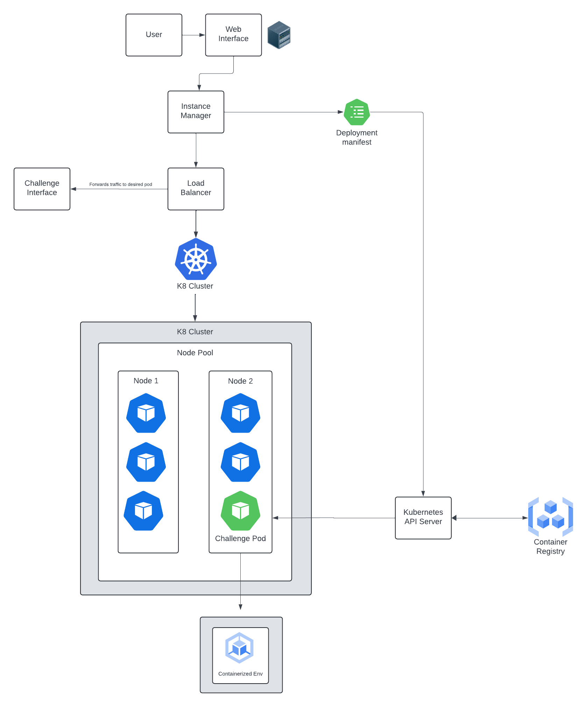

# EDURANGE CTF Module (WORK IN PROGRESS)

The EDURANGE CTF Module is a dynamic, Kubernetes-powered platform designed to host and manage Capture The Flag (CTF) challenges. It provides an automated system for deploying individual challenge instances, ensuring a unique and isolated environment for each participant.

## Features:

- **Dynamic Challenge Instances**: Utilizes Kubernetes to dynamically create and destroy challenge instances, allowing each user to have a unique experience.
- **Scalable and Isolated**: Leverages Kubernetes' scalability and isolation capabilities to manage multiple participants and challenges efficiently.
- **Diverse Challenge Support**: Offers support for various types of challenges, including web challenges and file carving, with many more to come in the future

## Getting Started:

These instructions will probally get you a copy of the project up and running on your local machine for development and testing purposes. It also might not, the project is very early in development.

### Prerequisites:

- Docker
- Kubernetes cluster (Minikube for local development)
- Python 3.8+
- Flask

### Installation:

1. **Clone the Repository**

    ```bash
    git clone https://github.com/Rydersel/EDURANGE_CTF_Module.git
    cd EDURANGE_CTF_Module
    ```

2. **Set up a Kubernetes Cluster**

    For local development, start Minikube:

    ```bash
    minikube start
    ```

3. **Build and Deploy the Flask Backend**

    - Navigate to the Flask backend directory:

      ```bash
      cd instance-manager
      ```

    - Build the Docker image:

      ```bash
      docker build -t edurange-ctf-backend .
      ```

    - Apply Kubernetes configurations:

      ```bash
      kubectl apply -f k8s/
      ```

4. **Access the Web Interface**

    - Find the Minikube IP:

      ```bash
      minikube ip
      ```

    - Access the Flask application via the provided IP and NodePort specified in the service configuration.

### Usage:

To start a new CTF challenge instance:

1. Make a POST request to the Flask backend:

    ```bash
    curl -X POST http://<flask-backend-ip>:<port>/api/start-challenge -H "Content-Type: application/json" -d '{"user_id": "<user_id>"}'
    ```

2. Access the challenge instance through the provided URL.


## License:

Distributed under the MIT License. See `LICENSE` for more information.

(Does anyone actually know what that means? I just put it on all my README's since everyone else does.)
## Diagram of Challenge Initialization: 


